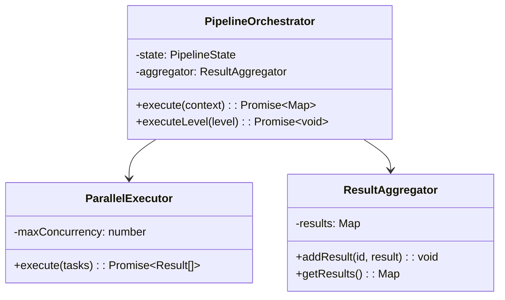
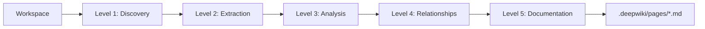

# DeepWiki Generator - アーキテクチャ再設計書

## 原則

1. **中間ファイルをどんどん生成** - 各フェーズの結果を保存し、再利用可能に
2. **LLMを大量に呼び出して精度を最高まで** - 複数のLLM呼び出しで品質を担保
3. **LLMに成果物を再確認・フィードバック** - 生成→レビュー→改善のループ

---

## 現状の問題点

| 問題 | 現状 | DeepWiki |
|------|------|----------|
| ソースコード参照 | なし | `[file:line-range]()` 形式で全てリンク |
| コード分析の深さ | メタデータのみ | 実装詳細まで抽出 |
| ページ階層 | フラット（1階層） | 30+ページ、深い階層 |
| 図の精度 | 一般的なテンプレート | 実際のクラス関係図 |
| LLM利用 | 1回生成で終わり | 複数回のフィードバックループ |

---

## 新アーキテクチャ概要

### パイプライン構造（7レベル）

```
Level 1: DISCOVERY        - ファイル発見・基本情報収集
Level 2: CODE_EXTRACTION  - コード詳細抽出（行番号付き）
Level 3: DEEP_ANALYSIS    - 実装詳細分析（LLM×複数回）
Level 4: RELATIONSHIP     - 依存関係・呼び出し関係構築
Level 5: DOCUMENTATION    - ドキュメント生成（LLM×フィードバックループ）
Level 6: QUALITY_REVIEW   - 品質レビュー・改善（LLM×複数回）
Level 7: OUTPUT           - 最終出力生成
```

---

## Level 1: DISCOVERY（発見フェーズ）

### 目的
プロジェクトの全体像を把握する

### サブエージェント

| ID | 名前 | 入力 | 出力 | 中間ファイル |
|----|------|------|------|-------------|
| `file-scanner` | ファイルスキャナー | workspace | FileInfo[] | `discovery/files.json` |
| `framework-detector` | フレームワーク検出 | package.json等 | Framework[] | `discovery/frameworks.json` |
| `language-detector` | 言語検出 | files | Languages | `discovery/languages.json` |
| `entry-point-finder` | エントリーポイント検出 | files | EntryPoint[] | `discovery/entry-points.json` |
| `config-finder` | 設定ファイル検出 | files | ConfigFile[] | `discovery/configs.json` |

### 出力例: `discovery/files.json`
```json
{
  "files": [
    {
      "path": "src/pipeline/orchestrator.ts",
      "relativePath": "src/pipeline/orchestrator.ts",
      "language": "typescript",
      "size": 15420,
      "lineCount": 340,
      "isEntryPoint": false,
      "isConfig": false,
      "category": "core"
    }
  ],
  "summary": {
    "totalFiles": 45,
    "totalLines": 12500,
    "byLanguage": { "typescript": 40, "json": 5 }
  }
}
```

---

## Level 2: CODE_EXTRACTION（コード抽出フェーズ）

### 目的
全てのコードエンティティを行番号付きで抽出する

### サブエージェント

| ID | 名前 | 説明 | 中間ファイル |
|----|------|------|-------------|
| `ast-parser` | AST解析 | 各ファイルをパース | `extraction/ast/{file}.json` |
| `class-extractor` | クラス抽出 | クラス定義を行番号付きで | `extraction/classes.json` |
| `function-extractor` | 関数抽出 | 関数定義を行番号付きで | `extraction/functions.json` |
| `type-extractor` | 型抽出 | interface/type定義 | `extraction/types.json` |
| `import-extractor` | インポート抽出 | import文を行番号付きで | `extraction/imports.json` |
| `export-extractor` | エクスポート抽出 | export文を行番号付きで | `extraction/exports.json` |

### 出力例: `extraction/classes.json`
```json
{
  "classes": [
    {
      "name": "PipelineOrchestrator",
      "file": "src/pipeline/orchestrator.ts",
      "startLine": 47,
      "endLine": 340,
      "sourceRef": "[src/pipeline/orchestrator.ts:47-340]()",
      "extends": null,
      "implements": ["Disposable"],
      "properties": [
        {
          "name": "state",
          "type": "PipelineState",
          "visibility": "private",
          "line": 52,
          "sourceRef": "[src/pipeline/orchestrator.ts:52]()"
        }
      ],
      "methods": [
        {
          "name": "execute",
          "signature": "execute(context: PipelineContext): Promise<Map<string, unknown>>",
          "startLine": 69,
          "endLine": 145,
          "sourceRef": "[src/pipeline/orchestrator.ts:69-145]()",
          "visibility": "public",
          "isAsync": true,
          "parameters": [
            { "name": "context", "type": "PipelineContext" }
          ],
          "returnType": "Promise<Map<string, unknown>>"
        }
      ],
      "constructorInfo": {
        "startLine": 58,
        "endLine": 67,
        "parameters": []
      }
    }
  ]
}
```

### 出力例: `extraction/imports.json`
```json
{
  "imports": [
    {
      "file": "src/pipeline/orchestrator.ts",
      "line": 1,
      "source": "vscode",
      "items": ["*"],
      "isTypeOnly": false
    },
    {
      "file": "src/pipeline/orchestrator.ts",
      "line": 3,
      "source": "../subagents",
      "items": ["BaseSubagent", "SubagentRegistry"],
      "isTypeOnly": false
    }
  ],
  "byFile": {
    "src/pipeline/orchestrator.ts": [
      { "source": "vscode", "line": 1 },
      { "source": "../subagents", "line": 3 }
    ]
  }
}
```

---

## Level 3: DEEP_ANALYSIS（深層分析フェーズ）

### 目的
LLMを使って各コードエンティティの実装詳細を分析する

### サブエージェント

| ID | 名前 | 説明 | LLM呼び出し | 中間ファイル |
|----|------|------|------------|-------------|
| `class-analyzer` | クラス分析 | 各クラスの責務・設計パターン | クラスごとに1回 | `analysis/classes/{ClassName}.json` |
| `function-analyzer` | 関数分析 | 各関数の目的・ロジック | 関数ごとに1回 | `analysis/functions/{functionName}.json` |
| `module-analyzer` | モジュール分析 | ディレクトリ単位の責務 | モジュールごとに1回 | `analysis/modules/{moduleName}.json` |
| `pattern-detector` | パターン検出 | デザインパターン検出 | 1回 | `analysis/patterns.json` |
| `complexity-analyzer` | 複雑度分析 | 循環的複雑度等 | なし（静的） | `analysis/complexity.json` |

### LLM分析プロンプト例（クラス分析）

```
Analyze this TypeScript class in detail.

Class: PipelineOrchestrator
File: src/pipeline/orchestrator.ts:47-340

Code:
```typescript
[実際のコード全文]
```

Provide analysis in JSON format:
{
  "purpose": "1-2 sentence description of what this class does",
  "responsibilities": ["responsibility 1", "responsibility 2"],
  "designPatterns": ["pattern name if applicable"],
  "keyMethods": [
    {
      "name": "execute",
      "purpose": "what this method does",
      "algorithm": "brief description of the algorithm/logic",
      "complexity": "O(n) or similar",
      "sideEffects": ["list of side effects"]
    }
  ],
  "stateManagement": "how state is managed",
  "errorHandling": "how errors are handled",
  "dependencies": ["what this class depends on"],
  "usedBy": ["what uses this class, if determinable"]
}
```

### 出力例: `analysis/classes/PipelineOrchestrator.json`
```json
{
  "name": "PipelineOrchestrator",
  "sourceRef": "[src/pipeline/orchestrator.ts:47-340]()",
  "purpose": "Orchestrates the multi-level documentation generation pipeline by executing subagents in parallel within each level",
  "responsibilities": [
    "Manage pipeline execution state",
    "Execute subagents in parallel per level",
    "Aggregate results across levels",
    "Handle cancellation and errors"
  ],
  "designPatterns": ["Pipeline", "Strategy (via subagents)"],
  "keyMethods": [
    {
      "name": "execute",
      "sourceRef": "[src/pipeline/orchestrator.ts:69-145]()",
      "purpose": "Execute the full pipeline from Level 1 to Level 5",
      "algorithm": "Iterates through LEVEL_ORDER, executes each level via executeLevel(), aggregates results",
      "complexity": "O(levels × subagents)",
      "sideEffects": ["Updates state", "Writes intermediate files"]
    },
    {
      "name": "executeLevel",
      "sourceRef": "[src/pipeline/orchestrator.ts:147-203]()",
      "purpose": "Execute all subagents for a single pipeline level",
      "algorithm": "Separates parallel vs sequential tasks, uses ParallelExecutor for concurrent execution",
      "complexity": "O(tasks)",
      "sideEffects": ["Reports progress", "May write intermediate files"]
    }
  ],
  "stateManagement": "Uses PipelineState enum tracked in this.state property",
  "errorHandling": "Catches errors per-task, aggregates failures, continues pipeline if possible",
  "dependencies": [
    "ParallelExecutor [src/pipeline/parallelExecutor.ts:14-89]()",
    "ResultAggregator [src/pipeline/resultAggregator.ts:8-156]()",
    "SubagentRegistry [src/subagents/index.ts:1-50]()"
  ],
  "usedBy": [
    "DeepWikiTool.execute() [src/tools/deepWikiTool.ts:94]()"
  ],
  "llmAnalyzedAt": "2025-12-06T10:00:00Z",
  "analysisVersion": 1
}
```

---

## Level 4: RELATIONSHIP（関係構築フェーズ）

### 目的
コード間の関係性を構築する

### サブエージェント

| ID | 名前 | 説明 | 中間ファイル |
|----|------|------|-------------|
| `dependency-graph-builder` | 依存グラフ構築 | import関係をグラフ化 | `relationships/dependency-graph.json` |
| `call-graph-builder` | 呼び出しグラフ構築 | 関数呼び出し関係 | `relationships/call-graph.json` |
| `inheritance-tree-builder` | 継承ツリー構築 | クラス継承関係 | `relationships/inheritance.json` |
| `module-boundary-definer` | モジュール境界定義 | 論理的モジュール分割 | `relationships/modules.json` |
| `cross-reference-builder` | 相互参照構築 | どこで何が使われるか | `relationships/cross-refs.json` |

### 出力例: `relationships/dependency-graph.json`
```json
{
  "nodes": [
    {
      "id": "src/pipeline/orchestrator.ts",
      "type": "file",
      "module": "pipeline"
    }
  ],
  "edges": [
    {
      "from": "src/pipeline/orchestrator.ts",
      "to": "src/subagents/index.ts",
      "type": "import",
      "line": 3,
      "items": ["BaseSubagent", "SubagentRegistry"]
    }
  ],
  "modules": {
    "pipeline": {
      "files": ["src/pipeline/orchestrator.ts", "src/pipeline/parallelExecutor.ts"],
      "exports": ["PipelineOrchestrator", "ParallelExecutor"],
      "dependencies": ["subagents", "utils"]
    }
  }
}
```

### 出力例: `relationships/cross-refs.json`
```json
{
  "byEntity": {
    "PipelineOrchestrator": {
      "definedAt": "[src/pipeline/orchestrator.ts:47]()",
      "usedAt": [
        {
          "file": "src/tools/deepWikiTool.ts",
          "line": 94,
          "context": "const orchestrator = new PipelineOrchestrator()",
          "sourceRef": "[src/tools/deepWikiTool.ts:94]()"
        }
      ],
      "importedBy": [
        {
          "file": "src/tools/deepWikiTool.ts",
          "line": 5,
          "sourceRef": "[src/tools/deepWikiTool.ts:5]()"
        }
      ]
    }
  }
}
```

---

## Level 5: DOCUMENTATION（ドキュメント生成フェーズ）

### 目的
LLMを使って各ページのコンテンツを生成する

### ページ構造（DeepWiki形式）

```
1. Overview
   1.1 Architecture Overview

2. Getting Started
   2.1 Installation
   2.2 Configuration
   2.3 Basic Usage

3. User Guide
   3.1 Interactive Mode
   3.2 CLI Commands
   3.3 [その他プロジェクト固有のガイド]

4. Core Systems (動的生成)
   4.1 {Module A}
       4.1.1 Overview
       4.1.2 Architecture
       4.1.3 Key Components
       4.1.4 API Reference
   4.2 {Module B}
       ...

5. Advanced Topics
   5.1 Extension System
   5.2 Performance
   5.3 Security

6. Development
   6.1 Setup
   6.2 Testing
   6.3 Contributing

7. API Reference (動的生成)
   7.1 {Module A} API
       7.1.1 Classes
       7.1.2 Functions
       7.1.3 Types
   7.2 {Module B} API
       ...
```

### サブエージェント

| ID | 名前 | 説明 | LLM呼び出し | 中間ファイル |
|----|------|------|------------|-------------|
| `overview-page-generator` | Overview生成 | トップページ | 2-3回 | `docs/pages/1-overview.md` |
| `architecture-page-generator` | アーキテクチャ生成 | 構造説明 | 2-3回 | `docs/pages/1.1-architecture.md` |
| `getting-started-generator` | Getting Started生成 | 入門ガイド | ページごと2-3回 | `docs/pages/2-*.md` |
| `module-page-generator` | モジュールページ生成 | 各モジュール詳細 | モジュールごと3-5回 | `docs/pages/4.{n}-*.md` |
| `api-reference-generator` | APIリファレンス生成 | API詳細 | エンティティごと1-2回 | `docs/pages/7-*.md` |
| `diagram-generator` | 図生成 | Mermaid図 | 図ごと1回 | `docs/diagrams/*.mermaid` |

### LLMフィードバックループ

```
┌─────────────────────────────────────────────────────────────────┐
│                    ドキュメント生成ループ                         │
├─────────────────────────────────────────────────────────────────┤
│                                                                 │
│  1. 初期生成 (LLM Call #1)                                      │
│     Input: 分析結果 + ソースコード + コンテキスト                   │
│     Output: ドキュメント草稿                                      │
│                                                                 │
│  2. 品質レビュー (LLM Call #2)                                   │
│     Input: 草稿 + 評価基準                                       │
│     Output: スコア + 具体的な問題点 + 改善提案                     │
│                                                                 │
│  3. 改善 (LLM Call #3)                                          │
│     Input: 草稿 + レビュー結果                                    │
│     Output: 改善版ドキュメント                                    │
│                                                                 │
│  4. 最終確認 (LLM Call #4) [スコア < 8の場合のみ]                  │
│     Input: 改善版 + 元の分析結果                                  │
│     Output: 最終版 or 追加改善                                    │
│                                                                 │
│  Target: Score >= 8/10                                          │
│  Max Iterations: 4                                              │
│                                                                 │
└─────────────────────────────────────────────────────────────────┘
```

### ドキュメント生成プロンプト例（モジュールページ）

```
Generate comprehensive documentation for the "pipeline" module.

## Source Information

### Module Overview
- Path: src/pipeline/
- Files: orchestrator.ts, parallelExecutor.ts, resultAggregator.ts
- Total Lines: 586

### Classes (with source references)
1. PipelineOrchestrator [src/pipeline/orchestrator.ts:47-340]()
   - Purpose: Orchestrates multi-level pipeline execution
   - Key Methods:
     - execute() [src/pipeline/orchestrator.ts:69-145](): Main entry point
     - executeLevel() [src/pipeline/orchestrator.ts:147-203](): Per-level execution

2. ParallelExecutor [src/pipeline/parallelExecutor.ts:14-89]()
   - Purpose: Executes tasks in parallel with concurrency control
   ...

### Relationships
- Imports from: ../subagents, ../utils
- Used by: src/tools/deepWikiTool.ts

### Analysis Results
[JSONの分析結果を含める]

## Requirements

Generate a Markdown document with:

1. **Overview Section**
   - What this module does (1-2 paragraphs)
   - Key responsibilities
   - Where it fits in the overall system

2. **Architecture Section**
   - How the module is organized
   - Design patterns used
   - Include a Mermaid diagram showing class relationships

3. **Key Components Section**
   - For each major class/function:
     - Purpose and responsibility
     - Key methods with **source references** [file:line]()
     - Usage examples

4. **Data Flow Section**
   - How data moves through this module
   - Input/output formats

5. **Usage Examples Section**
   - Real code examples (can reference actual code in the project)

6. **API Reference Section**
   - List all public exports with signatures
   - Each with **source reference** [file:line]()

**CRITICAL**: Every code entity mention MUST include a source reference in format [file:line-range]()
```

### 出力例: `docs/pages/4.1-pipeline.md`

```markdown
# Pipeline Module

## Overview

The Pipeline module is the core orchestration system that manages the multi-stage documentation generation process. It coordinates the execution of 40+ subagents across 5 pipeline levels, handling parallel execution, result aggregation, and error recovery.

**Sources:** [src/pipeline/orchestrator.ts:1-340](), [src/pipeline/parallelExecutor.ts:1-89]()

## Architecture

The module follows a Pipeline pattern combined with Strategy pattern (via pluggable subagents).



### Design Patterns
- **Pipeline Pattern**: Sequential level execution [src/pipeline/orchestrator.ts:69-145]()
- **Strategy Pattern**: Subagents as interchangeable strategies
- **Aggregator Pattern**: ResultAggregator collects outputs [src/pipeline/resultAggregator.ts:8-156]()

## Key Components

### PipelineOrchestrator

**Source:** [src/pipeline/orchestrator.ts:47-340]()

The main orchestrator that drives the documentation generation process.

#### Key Methods

| Method | Location | Purpose |
|--------|----------|---------|
| `execute()` | [src/pipeline/orchestrator.ts:69-145]() | Main entry point, executes all pipeline levels |
| `executeLevel()` | [src/pipeline/orchestrator.ts:147-203]() | Executes all tasks for a single level |
| `buildExecutionPlan()` | [src/pipeline/orchestrator.ts:205-267]() | Creates task dependency graph |

#### execute()

```typescript
// [src/pipeline/orchestrator.ts:69-145]()
async execute(context: PipelineContext): Promise<Map<string, unknown>> {
  this.state = PipelineState.Running;

  for (const level of LEVEL_ORDER) {
    await this.executeLevel(level, context);
  }

  return this.aggregator.getResults();
}
```

**Algorithm:**
1. Set state to Running
2. Iterate through LEVEL_ORDER (ANALYSIS → DEEP_ANALYSIS → ... → OUTPUT)
3. For each level, call executeLevel() which runs subagents in parallel
4. Return aggregated results

### ParallelExecutor

**Source:** [src/pipeline/parallelExecutor.ts:14-89]()

Executes multiple tasks concurrently with configurable concurrency limits.

...

## Data Flow



## Usage Examples

### Basic Usage

```typescript
// [src/tools/deepWikiTool.ts:94-120]()
import { PipelineOrchestrator } from '../pipeline/orchestrator';

const orchestrator = new PipelineOrchestrator();
const results = await orchestrator.execute({
  workspaceFolder,
  model,
  progress: (msg) => console.log(msg),
  token: cancellationToken,
});
```

## API Reference

### Exports

| Export | Type | Source |
|--------|------|--------|
| `PipelineOrchestrator` | class | [src/pipeline/orchestrator.ts:47]() |
| `ParallelExecutor` | class | [src/pipeline/parallelExecutor.ts:14]() |
| `ResultAggregator` | class | [src/pipeline/resultAggregator.ts:8]() |
| `PipelineState` | enum | [src/pipeline/orchestrator.ts:12]() |
| `PipelineLevel` | enum | [src/pipeline/orchestrator.ts:20]() |

### PipelineOrchestrator API

```typescript
class PipelineOrchestrator {
  constructor();
  execute(context: PipelineContext): Promise<Map<string, unknown>>;
  getProgress(): { current: number; total: number; currentTask: string };
  cancel(): void;
}
```
```

---

## Level 6: QUALITY_REVIEW（品質レビューフェーズ）

### 目的
生成されたドキュメント全体の品質を保証する

### サブエージェント

| ID | 名前 | 説明 | LLM呼び出し | 中間ファイル |
|----|------|------|------------|-------------|
| `source-reference-validator` | ソース参照検証 | 全ての参照が実在するか | なし（静的） | `review/source-refs.json` |
| `completeness-checker` | 完全性チェック | 全publicエンティティが文書化されているか | 1回 | `review/completeness.json` |
| `accuracy-validator` | 正確性検証 | コードと記述が一致するか | ページごと1回 | `review/accuracy.json` |
| `consistency-checker` | 一貫性チェック | 用語・スタイルの一貫性 | 1回 | `review/consistency.json` |
| `cross-link-validator` | 相互リンク検証 | リンク切れチェック | なし（静的） | `review/links.json` |
| `overall-quality-reviewer` | 総合品質レビュー | 全体評価 | 1回 | `review/overall.json` |
| `improvement-applier` | 改善適用 | レビュー結果に基づく改善 | 問題ページごと1回 | - |

### 品質レビュープロンプト例

```
Review this documentation page for quality.

Page: 4.1-pipeline.md
Content:
[ページ内容全文]

Source Analysis Data:
[関連する分析データ]

Evaluate on these criteria (1-10 scale):

1. **Technical Accuracy** (weight: 30%)
   - Does the description match the actual code?
   - Are source references correct?
   - Are algorithms/patterns described accurately?

2. **Completeness** (weight: 25%)
   - Are all public APIs documented?
   - Are all key methods explained?
   - Are there missing sections?

3. **Source References** (weight: 20%)
   - Does every code entity have a source reference?
   - Are line numbers accurate?
   - Are references formatted correctly?

4. **Clarity** (weight: 15%)
   - Is the documentation easy to understand?
   - Are examples helpful?
   - Is the structure logical?

5. **Usefulness** (weight: 10%)
   - Would a developer find this helpful?
   - Are there actionable examples?
   - Does it answer likely questions?

Response format:
{
  "scores": {
    "technicalAccuracy": 8,
    "completeness": 7,
    "sourceReferences": 6,
    "clarity": 9,
    "usefulness": 8
  },
  "overallScore": 7.5,
  "issues": [
    {
      "severity": "high",
      "location": "Key Components > ParallelExecutor",
      "issue": "Missing source reference for execute() method",
      "suggestion": "Add [src/pipeline/parallelExecutor.ts:45-67]()"
    }
  ],
  "improvements": [
    "Add more code examples for error handling scenarios",
    "Include diagram showing task execution flow"
  ],
  "missingContent": [
    "Error handling section",
    "Configuration options"
  ]
}
```

---

## Level 7: OUTPUT（出力フェーズ）

### 目的
最終的なファイル群を生成する

### サブエージェント

| ID | 名前 | 説明 | 中間ファイル |
|----|------|------|-------------|
| `page-finalizer` | ページ最終化 | 改善済みページを最終形式に | `.deepwiki/pages/*.md` |
| `navigation-builder` | ナビゲーション構築 | サイドバー・目次 | `.deepwiki/pages/_meta.json` |
| `search-index-builder` | 検索インデックス構築 | 全文検索用 | `.deepwiki/search-index.json` |
| `site-config-generator` | サイト設定生成 | deepwiki.json | `.deepwiki/deepwiki.json` |
| `readme-generator` | README生成 | メインREADME | `.deepwiki/README.md` |

---

## 中間ファイル構造

```
.deepwiki/
├── intermediate/
│   ├── discovery/
│   │   ├── files.json              # 全ファイルリスト
│   │   ├── frameworks.json         # フレームワーク情報
│   │   ├── languages.json          # 言語情報
│   │   ├── entry-points.json       # エントリーポイント
│   │   └── configs.json            # 設定ファイル
│   │
│   ├── extraction/
│   │   ├── ast/
│   │   │   └── {file-hash}.json    # 各ファイルのAST
│   │   ├── classes.json            # 全クラス定義（行番号付き）
│   │   ├── functions.json          # 全関数定義（行番号付き）
│   │   ├── types.json              # 全型定義
│   │   ├── imports.json            # 全import文
│   │   └── exports.json            # 全export文
│   │
│   ├── analysis/
│   │   ├── classes/
│   │   │   └── {ClassName}.json    # クラスごとのLLM分析結果
│   │   ├── functions/
│   │   │   └── {functionName}.json # 関数ごとのLLM分析結果
│   │   ├── modules/
│   │   │   └── {moduleName}.json   # モジュールごとの分析結果
│   │   ├── patterns.json           # デザインパターン検出結果
│   │   └── complexity.json         # 複雑度分析結果
│   │
│   ├── relationships/
│   │   ├── dependency-graph.json   # ファイル間依存グラフ
│   │   ├── call-graph.json         # 関数呼び出しグラフ
│   │   ├── inheritance.json        # 継承関係
│   │   ├── modules.json            # モジュール境界定義
│   │   └── cross-refs.json         # 相互参照マップ
│   │
│   ├── docs/
│   │   ├── pages/
│   │   │   ├── 1-overview.md       # 生成ドキュメント（草稿）
│   │   │   ├── 1.1-architecture.md
│   │   │   └── ...
│   │   └── diagrams/
│   │       └── *.mermaid           # 図のソース
│   │
│   └── review/
│       ├── source-refs.json        # ソース参照検証結果
│       ├── completeness.json       # 完全性チェック結果
│       ├── accuracy.json           # 正確性検証結果
│       ├── consistency.json        # 一貫性チェック結果
│       ├── links.json              # リンク検証結果
│       └── overall.json            # 総合評価
│
├── pages/                          # 最終出力
│   ├── _meta.json                  # ナビゲーション
│   ├── 1-overview.md
│   ├── 1.1-architecture.md
│   ├── 2-getting-started.md
│   ├── 2.1-installation.md
│   ├── 2.2-configuration.md
│   ├── 4-core-systems.md
│   ├── 4.1-{module}.md
│   ├── 7-api-reference.md
│   ├── 7.1-{module}-api.md
│   └── ...
│
├── deepwiki.json                   # サイト設定
├── search-index.json               # 検索インデックス
└── README.md                       # メインREADME
```

---

## LLM呼び出し回数の見積もり

### 小規模プロジェクト（10ファイル、5モジュール）
| フェーズ | 呼び出し回数 |
|----------|-------------|
| Level 3: クラス分析 | ~15回 |
| Level 3: 関数分析 | ~30回 |
| Level 3: モジュール分析 | ~5回 |
| Level 5: ページ生成 | ~15回 × 3-4 = ~50回 |
| Level 6: 品質レビュー | ~20回 |
| **合計** | **~120回** |

### 中規模プロジェクト（50ファイル、15モジュール）
| フェーズ | 呼び出し回数 |
|----------|-------------|
| Level 3: クラス分析 | ~50回 |
| Level 3: 関数分析 | ~150回 |
| Level 3: モジュール分析 | ~15回 |
| Level 5: ページ生成 | ~40回 × 3-4 = ~150回 |
| Level 6: 品質レビュー | ~60回 |
| **合計** | **~425回** |

### 大規模プロジェクト（200ファイル、40モジュール）
| フェーズ | 呼び出し回数 |
|----------|-------------|
| Level 3: クラス分析 | ~200回 |
| Level 3: 関数分析 | ~600回 |
| Level 3: モジュール分析 | ~40回 |
| Level 5: ページ生成 | ~100回 × 3-4 = ~350回 |
| Level 6: 品質レビュー | ~150回 |
| **合計** | **~1,340回** |

---

## 実装優先順位

### Phase 1: 基盤構築（必須）
1. **CODE_EXTRACTIONレベル全体** - 行番号付きエンティティ抽出
2. **SourceReference型の徹底使用** - 全ての出力に参照を含める
3. **中間ファイルマネージャーの拡張** - 新しいファイル構造対応

### Phase 2: 深層分析
4. **DEEP_ANALYSISレベルの再実装** - LLMによるクラス/関数分析
5. **RELATIONSHIPレベルの実装** - 依存グラフ・呼び出しグラフ

### Phase 3: ドキュメント生成
6. **DOCUMENTATIONレベルの再実装** - ページ生成ロジック
7. **LLMフィードバックループの強化** - 4回までの反復改善

### Phase 4: 品質保証
8. **QUALITY_REVIEWレベルの実装** - 自動品質チェック
9. **改善自動適用** - レビュー結果に基づく自動修正

### Phase 5: 出力最適化
10. **OUTPUTレベルの最適化** - ナビゲーション・検索
11. **静的サイト生成対応** - Next.js/Docusaurus互換

---

## 次のステップ

1. この設計書のレビュー・承認
2. 新しい型定義（`src/types/`）の作成
3. CODE_EXTRACTIONレベルのサブエージェント実装
4. 既存コードのマイグレーション
