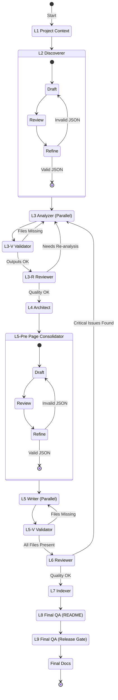

# DeepWiki Generator

A VS Code extension that generates comprehensive DeepWiki documentation for your workspace using **autonomous AI agents**.

## Features

-   **MISSION: World-Class DeepWiki**: Aims to produce technical documentation equivalent to "Devin's DeepWiki" standard (insightful, visual, structured, connected, **verified against actual source code**).
-   **Agentic Architecture**: Orchestrates specialized sub-agents to autonomously analyze, plan, draft, review, and publish documentation.
-   **Multi-Stage Pipeline**: Follows a robust multi-level (L1-L6) process plus Indexer and Final QA, where each agent builds upon the previous one's output.
-   **Self-Correction Loop**: L2 Discoverer, L5-Pre Page Consolidator, and L6 Page Reviewer can request re-analysis for fundamental issues, ensuring quality. Max 5 retries for L3/L4/L5 loop, max 6 retries for L2 and L5-Pre loops.
-   **Parallel Processing**: Analyzes logical components in parallel for faster execution. Concurrency is limited to 3 parallel agents to prevent API rate limiting. **File Validation Subagents** automatically detect missing output files and trigger retries for failed components.
-   **Component-Based Documentation**: Documents code by "Logical Components" (e.g., a Feature Module or UI Component) rather than single files, ensuring cohesive pages.
-   **Focus on Causality**: Agents are instructed to explain the "Why" and "How", detailing internal mechanics and external interfaces with causal reasoning.
-   **Fire-and-Forget**: Agents work directly on the file system, using intermediate files for seamless communication, minimizing chat output.
-   **Nested DeepWiki Awareness**: If a workspace subdirectory already contains `.deepwiki/README.md`, that subtree is excluded from analysis and the generated docs only link to the existing DeepWiki.
-   **Security & Safety**: Sub-agents operate under strict constraints, using only **allow-listed file system and search tools** (`read_file`, `create_file`, `file_search` etc.). Execution of shell commands (`run_in_terminal`) or external processes is strictly forbidden.
-   **Standard Compliant**: Leverages the standard `runSubagent` tool provided by VS Code / Copilot.

## Generation Pipeline

The extension orchestrates a sophisticated multi-stage agentic pipeline with two 3-stage refinement loops to generate high-quality documentation:



### 1. Level 1: PROJECT CONTEXT ANALYZER
Analyzes the project structure, build system, and conditional code patterns before component discovery:
-   **Project Type**: Identifies languages, frameworks, and project structure
-   **Build System**: Detects Makefile, CMake, npm, Cargo, Gradle, etc.
-   **Conditional Patterns**: Finds `#ifdef`, `process.env` checks, feature flags
-   **Excluded Code**: Identifies vendor/, generated/, third_party/ paths
-   **Output**: `project_context.md` for downstream agents to reference

This phase enables DeepWiki to be aware of build configurations and feature flags.

### 2. Level 2: DISCOVERER (Component Grouping & Refinement)
Identifies and groups files into logical components, and determines their importance (High/Medium/Low). Uses L1 context to understand project structure. This stage uses a 3-step internal process:
-   **L2-A Drafter**: Proposes an initial component list (`component_draft.json`), considering L1 project context.
-   **L2-B Reviewer**: Critiques the draft and writes a review report (`review_report.md`). **Verifies against the ACTUAL file system structure.**
-   **L2-C Refiner**: Applies fixes based on the review, producing the final component list (`component_list.json`).
    -   *Self-Correction Loop*: L2-B and L2-C run in a loop (max 6 retries) until a valid `component_list.json` is produced.

### 3. Level 3: ANALYZER (Parallel)
Deeply analyzes the logic, patterns, and responsibilities of each component. Focuses on **causal reasoning** ("If X, then Y") and adapts analysis depth based on the component's **importance**.
-   **Output**: Produces individual analysis files for each component (`intermediate/L3/{ComponentName}_analysis.md`).

**L3-V Validator**: After analysis completes, validates that all expected output files exist. If files are missing, triggers automatic retry for failed components using the same analysis logic.

### 4. Level 4: ARCHITECT
Synthesizes a high-level system overview and maps relationships between components. Analyzes **causal impact** (how changes propagate) and generates Mermaid diagrams.
-   **Input**: Considers **all L3 analysis files** (even those from previous retry loops) to maintain an up-to-date global view.

### 5. Level 5-Pre: PAGE CONSOLIDATOR
Determines the optimal page structure by analyzing L3 outputs. Uses a 3-stage process similar to L2:
-   **L5-Pre-A Drafter**: Proposes initial page groupings based on component analysis (`page_structure_draft.json`).
-   **L5-Pre-B Reviewer**: Critiques the groupings for logical coherence and user experience (`page_structure_review.md`).
-   **L5-Pre-C Refiner**: Produces the final page structure (`page_structure.json`).
    -   *Self-Correction Loop*: L5-Pre-B and L5-Pre-C run in a loop (max 6 retries) until a valid `page_structure.json` is produced.

This phase consolidates similar components into single cohesive pages, reducing redundancy and improving documentation quality.

### 6. Level 5: WRITER (Parallel)
Generates the final documentation pages based on `page_structure.json` (`pages/{PageName}.md`). When multiple components are consolidated into one page, weaves their descriptions together cohesively. Clearly distinguishes **External Interface** from **Internal Mechanics** and focuses on **causal flow** descriptions. Includes ASCII file structure trees for better visualization.
-   **Grounding via Sources**: Each page includes a `## Sources` section listing the source files used to justify claims.

**L5-V Validator**: After writing completes, validates that all expected page files exist. If files are missing, triggers automatic retry for failed pages using the same writing logic.

### 7. Level 6: PAGE REVIEWER & RETRY LOOP
Checks all generated pages (`pages/*.md`) for quality (accuracy, completeness, connectivity, formatting).
-   **Verifies against ACTUAL SOURCE CODE**: Reads referenced source files to ensure descriptions are correct.
-   **Self-Correction**: Directly fixes minor issues in the pages.
-   **Critical Failure Loop**: If major issues are found, it can request re-analysis for specific components. This re-analysis **starts from L3 Analyzer** (rerunning L3, L4, L5-Pre, L5) to ensure fundamental issues are addressed, with a retry limit (max 5 loops).

### 8. Level 7: Indexer
Compiles the landing page (`README.md`) with:
-   **One-Line Summary**: Single sentence describing the entire system
-   **System Context**: C4Context diagram showing external interactions
-   **Core State Transitions**: stateDiagram-v2 showing the fundamental state machine
-   **Component Overview**: block diagram serving as a visual table of contents
-   **Component List**: Links to all generated pages with descriptions

### 9. Level 8: Final QA (README Verifier)
Re-checks `.deepwiki/README.md` claims/diagrams against generated pages (and source code as needed).

### 10. Level 9: Final QA (Release Gate)
Final integrity pass over generated docs: removes intermediate references/placeholders and fixes any broken final links.

## Usage

1.  Open a workspace in VS Code
2.  Open Copilot Chat (Ctrl+Shift-I or Cmd-Shift-I)
3.  Type: `@workspace #createDeepWiki`
4.  The tool will orchestrate agents to generate documentation in the `.deepwiki` folder.

## Hallucination Mitigation (Fact Check)

During generation, the extension runs AI review passes that verify claims against actual source code, removing anything unverifiable, and finishes with an AI-only cleanup pass that removes intermediate links and placeholders.
- Writes reports under `.deepwiki/intermediate/L8/` and `.deepwiki/intermediate/L9/`

## Logging & Troubleshooting

Detailed execution logs are output to the **VS Code Output Channel**.
Select **"DeepWiki Generator"** from the Output panel dropdown to see real-time progress, task durations, and error details.

## Generated Output

The extension creates a `.deepwiki` folder in your workspace root with the following structure:

```text
.deepwiki/
├── README.md               # Main landing page (System Overview and Table of Contents)
├── pages/                  # Documentation for each component
│   ├── AuthModule.md
│   ├── Utils.md
│   └── ...
└── intermediate/           # Intermediate artifacts (for debugging/context)
    ├── L1/                 # Project context phase outputs
    │   └── project_context.md      # Project structure, build system, conditional patterns
    │   ├── existing_deepwikis.md   # Nested DeepWiki list (excluded roots)
    │   └── existing_deepwikis.json # Nested DeepWiki list (machine-readable)
    ├── L2/                 # Discovery phase outputs
    │   ├── component_draft.json    # Initial draft from L2-A
    │   ├── review_report.md        # Review from L2-B
    │   └── component_list.json     # Final component list from L2-C
    ├── L3/                 # Analysis phase outputs (1 component per file)
    │   ├── 001_AuthModule_analysis.md
    │   ├── 002_Utils_analysis.md
    │   └── ...
    ├── L3V/                # L3 validator outputs
    │   └── validation_failures.json  # (temporary, lists failed components for retry)
    ├── L3R/                # L3 review gate outputs
    │   ├── 001_Component_review.md
    │   ├── 002_Component_review.md
    │   └── 001_Component_retry.json      # (temporary, deleted after processing)
    ├── L4/                 # Architecture phase outputs
    │   ├── overview.md
    │   └── relationships.md
    ├── L5/                 # Page consolidation phase outputs
    │   ├── page_structure_draft.json    # Initial draft from L5-Pre-A
    │   ├── page_structure_review.md     # Review from L5-Pre-B
    │   ├── page_structure.json          # Final page structure from L5-Pre-C
    │   └── ...
    ├── L5V/                # L5 validator outputs
    │   └── page_validation_failures.json  # (temporary, lists failed pages for retry)
    └── L6/                 # Review phase outputs
        └── retry_request.json      # (temporary, deleted after processing)
    ├── L7/                 # Indexer artifacts
    │   └── indexer_report.md        # Indexer summary
    ├── L8/                 # Final QA (README verifier)
    │   └── factcheck_report.md      # Fact-check summary
    └── L9/                 # Final QA (Release gate)
        └── release_gate_report.md   # Final integrity pass summary
```

## Requirements

-   VS Code 1.95.0 or higher
-   GitHub Copilot extension

## License

MIT
