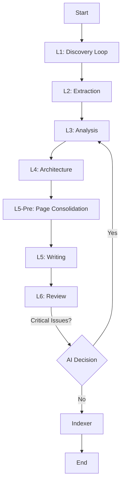

# Agent Orchestration Patterns: A Comprehensive Guide

In the era of Generative AI, building complex applications often involves coordinating multiple AI agents to achieve a goal. This process, known as **Agent Orchestration**, is critical for building reliable and scalable AI systems.

This guide explores three primary orchestration paradigms—**Programmatic**, **Agentic**, and **Hybrid**—and discusses how to implement them, particularly within the context of VS Code's `runSubagent` tool and frameworks like **LangGraph**.

---

## 1. Programmatic Orchestration (Code-Driven)

**"The Manager is Code."**

In this pattern, the workflow is explicitly defined in code (TypeScript, Python). The logic is deterministic: "Step A -> Step B -> Step C". AI models are treated as "functions" that are called at specific steps.

### Characteristics
- **Control**: High. You know exactly what happens when.
- **Reliability**: Deterministic flow ensures consistency.
- **Complexity**: The orchestrator code becomes complex as you add more logic (retries, conditionals).
- **Adaptability**: Low. The system cannot easily handle unforeseen scenarios outside the coded logic.

### DeepWiki Implementation Example
Our **DeepWiki Generator** started as a purely programmatic pipeline.
- The `DeepWikiTool` class (Manager) explicitly calls `runSubagent` for L1, then L2, then L3.
- Loops and retries are hard-coded in TypeScript (`while (retryCount < MAX) ...`).

```typescript
// Programmatic Orchestration in TypeScript
async function runPipeline() {
    await runPhase('L1: Discoverer');
    const files = readJson('files.json');
    
    // Hard-coded parallel execution
    await Promise.all(files.map(f => runPhase('L2: Extractor', f)));
    
    await runPhase('L3: Analyzer');
}
```

---

## 2. Agentic Orchestration (LLM-Driven)

**"The Manager is an Agent."**

Here, a top-level "Manager Agent" (LLM) is given a high-level goal and a set of tools (Worker Agents). The Manager autonomously decides which agents to call, in what order, and when to stop.

### Characteristics
- **Control**: Low. The LLM decides the path.
- **Reliability**: Variable. Can get stuck in loops or go off-track.
- **Complexity**: The prompt is complex, but the orchestration code is simple.
- **Adaptability**: High. Can dynamically adjust the plan based on findings.

### Example Scenario
If DeepWiki were purely agentic:
- **User**: "Document this workspace."
- **Manager Agent**: "Okay, I'll first check the file structure... [Calls L1]. Now I see many React files, so I'll call the UI-Analyzer [Calls L3]. Wait, I missed the backend, let me check that... [Calls L1 again]."

*This pattern is powerful but often too unpredictable for production workflows requiring strict output formats.*

---

## 3. Hybrid Orchestration (State Machines / Graphs)

**"The Manager is a Graph with an AI Brain."**

This approach, popularized by frameworks like **LangGraph**, models the workflow as a **State Graph** (nodes and edges).
- **Nodes**: Tasks (can be AI calls or deterministic code).
- **Edges**: Transitions.
    - **Fixed Edges**: Always go from A to B.
    - **Conditional Edges**: Use an LLM to decide where to go next (e.g., "Pass" -> End, "Fail" -> Retry).

### Characteristics
- **Control**: Balanced. You define the "bounds" of the graph.
- **Reliability**: High. Constraints prevent wild deviations.
- **Adaptability**: Moderate. The agent can choose paths within the graph.

### DeepWiki's Evolution
Our final DeepWiki implementation evolved into a **Hybrid Architecture**.
- **Graph Structure**: `L1 -> L2 -> L3 -> L4 -> L5-Pre -> L5 -> L6`.
- **Conditional Logic**:
    - **L6 Critical Failure Loop**: The L6 Reviewer (Agent) decides whether to loop back to L3 or proceed to Indexing.
    - **L1 Self-Correction**: The L1 Reviewer decides if the Draft needs refining.
    - **L5-Pre Page Consolidation**: A 3-stage (Draft → Review → Refine) process that groups similar components into single pages.



---

## Comparison & Selection Guide

| Feature | Programmatic | Agentic | Hybrid (Graph) |
| :--- | :--- | :--- | :--- |
| **Driver** | Code (Hard logic) | LLM (Prompt) | Graph (Code + LLM) |
| **Reliability** | ⭐⭐⭐⭐⭐ | ⭐⭐ | ⭐⭐⭐⭐ |
| **Flexibility** | ⭐ | ⭐⭐⭐⭐⭐ | ⭐⭐⭐ |
| **Debuggability** | Easy | Hard | Moderate |
| **Best For** | ETL, Data Pipelines, Fixed Reports | Research, Open-ended Chat, Brainstorming | **Complex Workflows, Coding Assistants, RAG** |

### Why Hybrid for VS Code Extensions?
For tools like `runSubagent` in VS Code:
1.  **Safety**: You don't want agents modifying random files forever. A graph structure imposes limits (e.g., `MAX_LOOPS`).
2.  **Quality**: You can force a "Review" step (Node) before "Commit" (Node).
3.  **UX**: You can provide progress updates as the agent moves through defined graph nodes.

## Conclusion

While "fully autonomous agents" are an exciting concept, **Hybrid Orchestration** currently offers the best trade-off for building production-grade AI tools. By defining a clear process (Graph) and letting AI make decisions only at key branching points (Conditional Edges), you can achieve "Reliable Autonomy."
