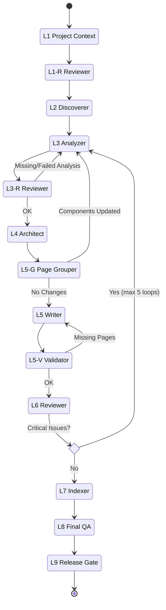

# Agent Orchestration Patterns

This guide explores orchestration paradigms for AI agents and explains why DeepWiki Generator uses a **Hybrid** approach.

## Orchestration Paradigms

### 1. Programmatic Orchestration (Code-Driven)

**"The Manager is Code."**

The workflow is explicitly defined in code. AI models are called as "functions" at specific steps.

| Aspect | Characteristic |
|--------|---------------|
| **Control** | High - deterministic flow |
| **Reliability** | Consistent results |
| **Adaptability** | Low - cannot handle unforeseen scenarios |
| **Complexity** | Grows with logic (retries, conditionals) |

```typescript
// Pure programmatic orchestration
async function runPipeline() {
    await runPhase('L1: Discoverer');
    const files = readJson('files.json');
    await Promise.all(files.map(f => runPhase('L2: Extractor', f)));
    await runPhase('L3: Analyzer');
}
```

### 2. Agentic Orchestration (LLM-Driven)

**"The Manager is an Agent."**

A top-level "Manager Agent" autonomously decides which agents to call, in what order, and when to stop.

| Aspect | Characteristic |
|--------|---------------|
| **Control** | Low - LLM decides path |
| **Reliability** | Variable - can get stuck |
| **Adaptability** | High - dynamically adjusts |
| **Complexity** | Simple code, complex prompts |

**Example scenario**:
> "Document this workspace."
> Manager: "I'll check file structure [L1]. Now I see React files, calling UI-Analyzer [L3]. Wait, I missed backend, let me check again [L1]."

*Too unpredictable for production workflows requiring strict output formats.*

### 3. Hybrid Orchestration (State Machines + AI)

**"The Manager is a Graph with an AI Brain."**

Combines the best of both:
- **Structure**: Graph defines valid paths and bounds
- **Intelligence**: AI makes decisions at branching points
- **Safety**: Constraints prevent wild deviations

| Aspect | Characteristic |
|--------|---------------|
| **Control** | Balanced - bounded autonomy |
| **Reliability** | High - constrained paths |
| **Adaptability** | Moderate - choices within graph |
| **Debuggability** | Good - visible state transitions |

---

## DeepWiki's Hybrid Architecture

DeepWiki evolved from programmatic to hybrid orchestration.

### Pipeline Graph


```mermaid
stateDiagram-v2
    [*] --> L1

    state "L1 Project Context" as L1
    state "L1-R Reviewer" as L1R
    state "L2 Discoverer" as L2
    state "L3 Analyzer" as L3
    state "L3-R Reviewer" as L3R
    state "L4 Architect" as L4
    state "L5-G Page Grouper" as L5G
    state "L5 Writer" as L5
    state "L5-V Validator" as L5V
    state "L6 Reviewer" as L6
    state "L7 Indexer" as L7
    state "L8 Final QA" as L8
    state "L9 Release Gate" as L9

    L1 --> L1R
    L1R --> L2
    L2 --> L3
    L3 --> L3R
    L3R --> L3: Missing/Failed Analysis
    L3R --> L4: OK

    L4 --> L5G
    L5G --> L3: Components Updated
    L5G --> L5: No Changes

    L5 --> L5V
    L5V --> L5: Missing Pages
    L5V --> L6: OK

    state L6_Decision <<choice>>
    L6 --> L6_Decision: Critical Issues?
    L6_Decision --> L3: Yes (max 5 loops)
    L6_Decision --> L7: No

    L7 --> L8
    L8 --> L9
    L9 --> [*]
```

### Fixed vs Conditional Edges

| Edge Type | Example | Decision Maker |
|-----------|---------|----------------|
| **Fixed** | L1 → L1-R → L2 | Code (always proceeds) |
| **Conditional** | L6 → L3 or L7 | Agent (based on quality assessment) |
| **Loop with Max** | L2 Draft→Review→Refine | Code enforces max 6 iterations |

### Self-Correction Mechanisms

| Mechanism | Trigger | Action | Limit |
|-----------|---------|--------|-------|
| **L2 Refinement** | Invalid JSON | Drafter → Reviewer → Refiner | 6 iterations |
| **L3-R Validation** | Missing analysis | Retry specific component | 1 per component |
| **L5-V Validation** | Missing page | Retry specific page | 1 per page |
| **L5-G Component Update** | L3/L4 revealed issues | Restart from L3 | Part of main loop |
| **L6 Critical Failure** | Fundamental issues | Re-analyze L3→L4→L5 | 5 loops total |

---

## Comparison & Selection Guide

| Feature | Programmatic | Agentic | Hybrid (Graph) |
|---------|--------------|---------|----------------|
| **Driver** | Code | LLM | Code + LLM |
| **Reliability** | ★★★★★ | ★★ | ★★★★ |
| **Flexibility** | ★ | ★★★★★ | ★★★ |
| **Debuggability** | Easy | Hard | Moderate |
| **Best For** | ETL, Fixed Pipelines | Research, Brainstorming | **Complex Workflows** |

### Why Hybrid for VS Code Extensions?

1. **Safety**: Graph imposes limits (e.g., `MAX_LOOPS = 5`)
2. **Quality**: Forced review steps before output
3. **UX**: Progress updates as graph transitions
4. **Maintainability**: Clear stages, each with defined I/O

---

## Design Patterns in DeepWiki

### 1. Validation Gates

Insert AI reviewers at strategic points:

```
L1 → L1-R (validate context)
L3 → L3-R (validate analysis)
L5 → L5-V (validate file existence)
```

Gates can:
- Fix issues directly (L1-R)
- Trigger targeted retries (L3-R, L5-V)
- Escalate to larger scope (L6 → L3)

### 2. Bounded Autonomy

Agents have freedom within constraints:

| Agent | Freedom | Constraint |
|-------|---------|------------|
| L2 Drafter | Choose component groupings | Must produce valid JSON |
| L3 Analyzer | Decide analysis depth | Must meet MUST requirements |
| L6 Reviewer | Request retry or proceed | Max 5 retry loops |

### 3. Progressive Context

Each stage builds on previous outputs:

```
L1 context → L2 components → L3 analysis → L4 architecture → L5 pages
```

Sequential processing ensures:
- L3 can fix L1 context for subsequent L3 runs
- L5-G can update components based on L3/L4 insights

### 4. Graceful Degradation

Pipeline continues despite individual failures:
- Failed L3 analysis → Retry once → Proceed (documented gap)
- Missing page → Retry once → Proceed (noted in README)

---

## Implementation Tips

### Defining Graph Edges

```typescript
// Fixed edge (always proceed)
await runPhase('L1');
await runPhase('L1R');  // Always after L1

// Conditional edge (agent decides)
const retryIds = await checkL6RetryRequest();
if (retryIds.length > 0 && loopCount < MAX_LOOPS) {
    // Edge: L6 → L3
    componentsToAnalyze = retryIds;
    continue;  // Back to L3
} else {
    // Edge: L6 → L7
    break;  // Exit loop, proceed to L7
}
```

### State Persistence

Use file system for graph state:
- `component_list.json` - Current component set
- `retry_request.json` - Components needing retry
- `page_groups.json` - Navigation structure

### Limiting Iterations

```typescript
const MAX_LOOPS = 5;
let loopCount = 0;

while (componentsToAnalyze.length > 0 && loopCount < MAX_LOOPS) {
    // ... L3-L6 ...
    loopCount++;
}

// Final loop: L6 fixes in place, no more retries
if (loopCount === MAX_LOOPS - 1) {
    // Instruct L6 to fix directly, not request retry
}
```

---

## Conclusion

**Hybrid Orchestration** offers the best trade-off for production AI tools:

| Benefit | How DeepWiki Achieves It |
|---------|-------------------------|
| **Reliable Autonomy** | Graph bounds + AI decisions at edges |
| **Quality Assurance** | Validation gates (L1-R, L3-R, L5-V, L6) |
| **Self-Correction** | Multiple feedback loops with limits |
| **Debuggability** | Clear stages, file-based artifacts |

By defining a clear process (Graph) and letting AI make decisions only at key branching points (Conditional Edges), you achieve "Reliable Autonomy."
