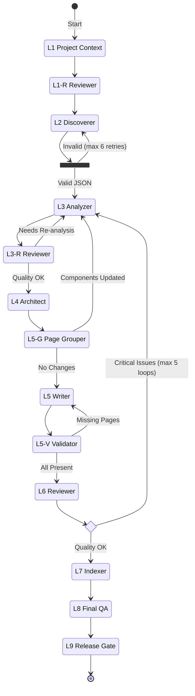

# Architecture Overview

This document describes the architecture of the DeepWiki Generator extension, including the pipeline design, data flow, and key design decisions.

## System Architecture

DeepWiki Generator uses a **Hybrid Orchestration** approach that combines:
- **Programmatic control** (TypeScript code manages flow, retries, and state)
- **Agentic intelligence** (AI sub-agents handle complex analysis and writing tasks)

```
┌─────────────────────────────────────────────────────────────────────┐
│                        VS Code Extension Host                        │
├─────────────────────────────────────────────────────────────────────┤
│  ┌─────────────────┐                                                │
│  │  DeepWikiTool   │  ◄── Manager (TypeScript)                      │
│  │  (Orchestrator) │      - Controls pipeline flow                  │
│  └────────┬────────┘      - Manages state & retries                 │
│           │               - Reads/validates artifacts               │
│           ▼                                                         │
│  ┌─────────────────┐                                                │
│  │  vscode.lm      │                                                │
│  │  .invokeTool()  │  ◄── Sub-agent invocation API                  │
│  └────────┬────────┘                                                │
│           │                                                         │
│           ▼                                                         │
│  ┌─────────────────────────────────────────────────────────────┐   │
│  │                    runSubagent Workers                       │   │
│  │  ┌─────┐ ┌─────┐ ┌─────┐ ┌─────┐ ┌─────┐ ┌─────┐ ┌─────┐   │   │
│  │  │ L1  │ │ L2  │ │ L3  │ │ L4  │ │ L5  │ │ L6  │ │ L7+ │   │   │
│  │  └─────┘ └─────┘ └─────┘ └─────┘ └─────┘ └─────┘ └─────┘   │   │
│  │  Each worker: Reads files → Analyzes → Writes artifacts      │   │
│  └─────────────────────────────────────────────────────────────┘   │
└─────────────────────────────────────────────────────────────────────┘
                              │
                              ▼
┌─────────────────────────────────────────────────────────────────────┐
│                        File System (Shared State)                    │
│  .deepwiki/                                                         │
│  ├── intermediate/L1/project_context.md                             │
│  ├── intermediate/L2/component_list.json                            │
│  ├── intermediate/L3/*_analysis.md                                  │
│  ├── intermediate/L4/overview.md, relationships.md                  │
│  ├── pages/*.md                                                     │
│  └── README.md                                                      │
└─────────────────────────────────────────────────────────────────────┘
```

## Pipeline Flow

The pipeline consists of 9 stages (L1-L9) with validation gates and feedback loops:



## Data Flow

### Artifact Dependencies

| Stage | Reads | Writes |
|-------|-------|--------|
| L1 | Source code | `intermediate/L1/project_context.md` |
| L1-R | L1 output, Source code | Edits L1 output, `intermediate/L1R/review.md` |
| L2 | L1 output, Source code | `intermediate/L2/component_list.json` |
| L3 | L2 output, Source code, L1 context | `intermediate/L3/*_analysis.md`, may edit L1 |
| L3-R | L3 outputs, Source code | Review reports, retry requests |
| L4 | L3 outputs, L1 context | `intermediate/L4/overview.md`, `relationships.md` |
| L5-G | L3/L4 outputs, L1/L2 | `intermediate/L5/page_groups.json`, may edit L1/L2 |
| L5 | L3 analysis, L1 context | `pages/*.md` |
| L5-V | Expected page list | Retry requests for missing pages |
| L6 | All pages, L3 analysis, Source code | Edits pages, retry requests |
| L7 | L4 outputs, page_groups.json | `README.md` |
| L8 | README, pages, Source code | Edits README, `intermediate/L8/factcheck_report.md` |
| L9 | All docs | Final cleanup, `intermediate/L9/release_gate_report.md` |

### File System as Shared Memory

Sub-agents communicate exclusively through the file system:

1. **Manager** instructs agent to write to specific path
2. **Agent** reads inputs, processes, writes outputs
3. **Manager** reads output artifacts, decides next step

This pattern avoids token limits on chat responses and enables unlimited output size.

## Key Design Decisions

### 1. Sequential Processing with Context Propagation

Sub-agents run sequentially (not in parallel) to allow context propagation:
- L3 Analyzer can fix `project_context.md` for subsequent analyzers
- Each agent builds on verified, updated context

```typescript
// Tasks run one at a time, allowing context fixes to propagate
await runTasksSequentially(l3Tasks, 'L3 Analysis', token);
```

### 2. Validation Gates

Three validation stages catch issues early:

| Gate | Purpose | Action on Failure |
|------|---------|-------------------|
| **L1-R** | Verify project context accuracy | Direct fix |
| **L3-R** | Verify analysis completeness | Retry failed components |
| **L5-V** | Verify page file existence | Retry missing pages |

### 3. Self-Correction Loops

Multiple feedback mechanisms ensure quality:

| Loop | Trigger | Max Iterations |
|------|---------|----------------|
| **L2 Draft→Review→Refine** | Invalid JSON | 6 |
| **L3→L3R→L3 Retry** | Missing/broken analysis | 1 (per component) |
| **L5→L5V→L5 Retry** | Missing page files | 1 |
| **L6 Critical Failure** | Fundamental issues | 5 |

### 4. Proof-Driven Documentation

L3 Analyzer uses a two-phase approach to prevent hallucination:

1. **Phase 1 - Fact Extraction**: Extract verifiable facts with exact file:line references
2. **Phase 2 - Synthesis**: Convert only verified facts into documentation

### 5. Component ID Immutability

Components have two identifiers:
- **`id`**: Internal identifier (immutable, used for filenames and references)
- **`name`**: Display name (can be refined by L4 for clarity)

This enables stable file references while allowing display name improvements.

## Error Handling

### Retry Logic

The `runPhase` method includes automatic retry for transient failures:

```typescript
const isRetryableFailureText = (text: string): boolean =>
    /(your request failed|hit the length limit|rate limit|timeout)/i.test(text);
```

Failed phases are retried with exponential backoff (up to `maxAttempts`).

### Cancellation Support

All pipeline stages check for cancellation:

```typescript
const checkCancellation = (): void => {
    if (token.isCancellationRequested) {
        throw new vscode.CancellationError();
    }
};
```

## Extension Points

### Custom Tool Names

The pipeline accepts custom tool names for environment-specific integration:

| Parameter | Purpose |
|-----------|---------|
| `fileEditToolName` | File editing tool for sub-agents |
| `mermaidValidatorToolName` | Mermaid diagram validation |
| `codeUsagesToolName` | Code usage/reference lookup |

### Resume Capability

Pipeline can resume from any stage:

```typescript
startFromStage: 'L1' | 'L2' | 'L3' | 'L4' | 'L5' | 'L6' | 'L7' | 'L8' | 'L9' | 'auto'
```

The `auto` option uses an AI sub-agent to analyze existing artifacts and determine the optimal resume point.
